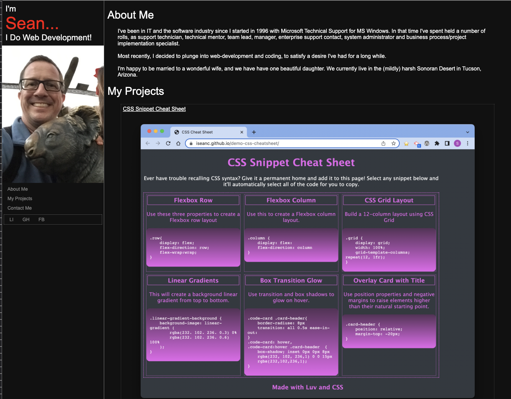
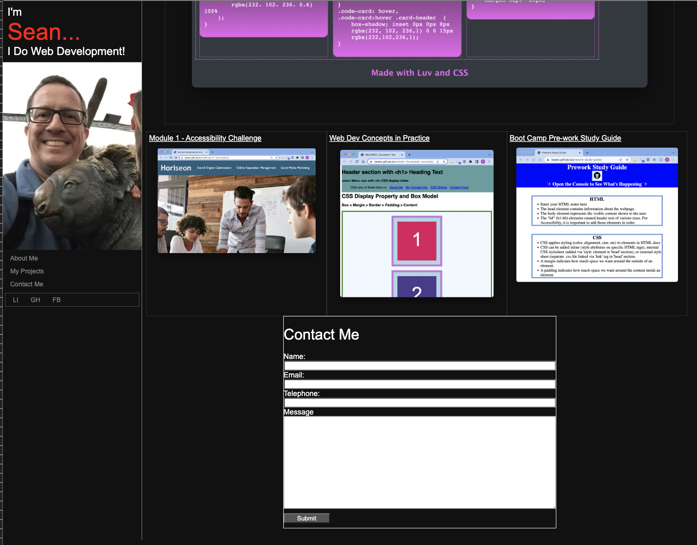

# Sean Collins' Web Development Portfolio

## Description

A web-page project to allow prospective employers and clients to view a deployed portfolio of my work, so they can review samples of my work and assess whether I'm a good candidate for an open position or contract.

The web page provides
- Information about me
- Links to deployed projects I've worked on
- Method(s) to contact me

## Table of Contents (Optional)

If your README is long, add a table of contents to make it easy for users to find what they need.

- [Portfolio](#portfolio)
- [Features](#features)
- [Credits](#credits)
- [License](#license)

## Portfolio

[Go to my portfolio](https://iseanc.github.io/iseancs-portfolio/)

## Features

- Side navigation bar
- Clickable navigation links for About Me, Portfolio, and Contact form.
- Clickable project previews navigate to my body of work samples.
- Clickable links to my social media pages.
- Page components resize and rearrange as viewport dimensions change.
- Semantic HTML elements.

## Credits

Made by me with extensive reference to sites like [W3Schools](https://www.w3schools.com/), [MDN](https://developer.mozilla.org/) and various other tutorials on the internet.

## License

https://img.shields.io/github/license/iseanc/iseancs-portfolio

